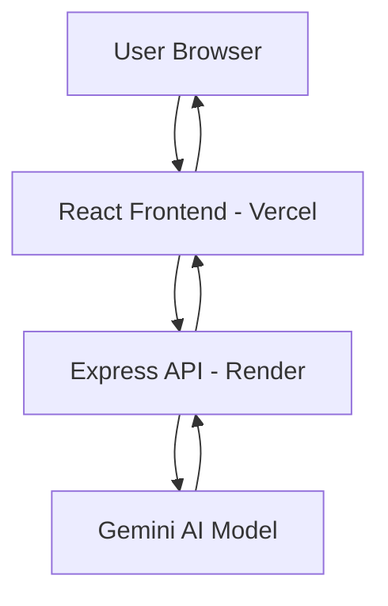

# 🎯 Interview Mirror  
### AI-Powered Interview Intelligence Platform

> A production-deployed full-stack AI system that simulates real interviews, evaluates candidate responses, and delivers structured, deterministic performance feedback using large language models.

🌍 **Live App:** https://interview-mirror-roan.vercel.app  
⚙️ **Backend API:** https://interview-mirror.onrender.com  

---

# 🧠 The Problem

Interview preparation today is shallow.

Most tools:
- Generate generic questions
- Provide vague feedback
- Ignore communication structure
- Do not simulate real interviewer evaluation
- Do not score answers with objective criteria

Real interviews test:
- Structure
- Clarity
- Depth
- Relevance
- Communication discipline
- STAR method usage
- Conciseness

Interview Mirror was built to simulate that rigor.

---

# 🚀 What This System Does

Interview Mirror functions as an AI-powered interview evaluator.

It:

- 🎯 Generates role- and difficulty-specific interview questions  
- 🎙 Accepts typed or voice-recorded answers  
- 🧠 Uses LLM evaluation with structured schema enforcement  
- 📊 Scores clarity, structure, relevance, conciseness, depth  
- ⭐ Detects STAR method usage for behavioral answers  
- 🚨 Flags rambling and filler words  
- ✍️ Rewrites answers into stronger versions  
- 🔁 Suggests realistic follow-up questions  

This is not a demo project.

It is a deployed AI evaluation system with production architecture.

---

# 🏗 System Architecture

## High-Level Architecture



```markdown
```mermaid
flowchart LR
    subgraph Question Generation
        U1[User] -->|New Question| FE1[Frontend]
        FE1 -->|POST /api/question| BE1[Backend]
        BE1 -->|Generate| AI1[Gemini]
        AI1 --> BE1
        BE1 --> FE1
    end

    subgraph Answer Evaluation
        U2[User] -->|Submit Answer| FE2[Frontend]
        FE2 -->|POST /api/analyze| BE2[Backend]
        BE2 -->|Evaluate| AI2[Gemini]
        AI2 --> BE2
        BE2 --> FE2
    end
